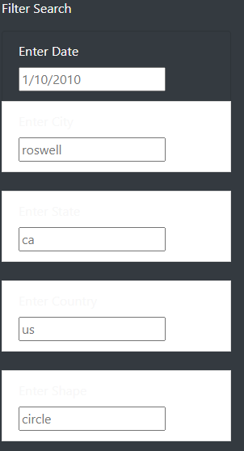
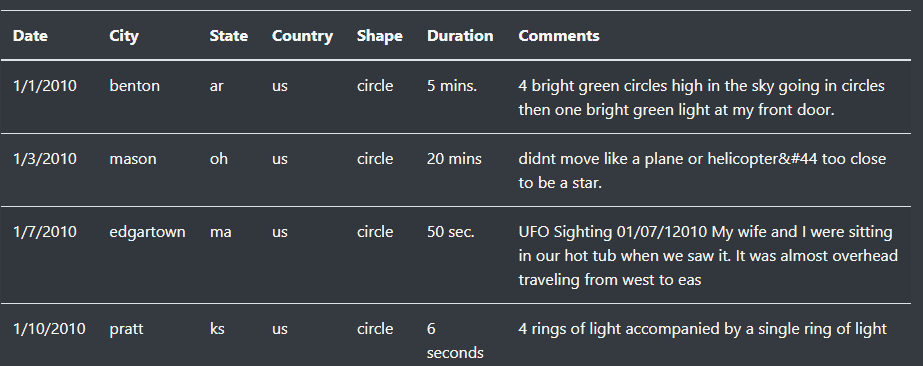

# UFOs and Javascript

Using Javascript, bootstrap to make a UFO sightings page

## Overview of the project:
For this project, we build a HTML page with filtering function that pulls up information from a javascript data file. We implement this by utilizing boostrap in Javascript and also add CSS file to update the style and imagery of the webpage.

## Results:
Once the `index.html` is opened on a web browser, the webpage will look like as below:

In order to filter the data, we can input specific date, City name, State, Country, and Shape of UFO in the available search bars

Then, the data with matching information will be shown on the webpage.

In order to initiate the filter, you can any of the listed filters with seach bar. Multiple filters can be utilized at once to futher filter the data in your interest.

## Summary:

Now, the webpage is ready for users to search for UFO sighting records that they are interested in.

However, the webpage has one major drawback that is the available data is very limited. In specific, the Javascript data carries sighting record from 1/1/2010-1/13/2010 and the information is collected from US only (with one exception from Canada). In order for to better serve the users visiting this website, the webpage needs major improvement in how to collect more UFO sighting information from wider time periods and from wider range of locations.

In addition to increasing the size of available data, the webpage should work on cleaning up the dataset for better looks in a table. For example, all City, State, and Country columns have entries written in lower case. The dataset should be refined to utilize upper case. Also, the data format in Duration column is very unorganized that their measurement unit varies from seconds to weeks! This column should be cleaned so that they share the same data format and allows users to filter information by the duration as well.
